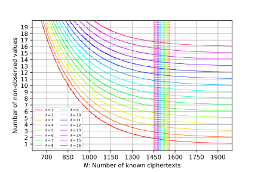
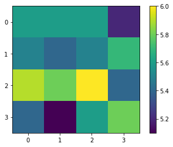
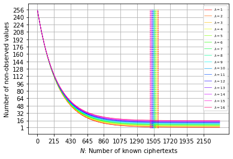
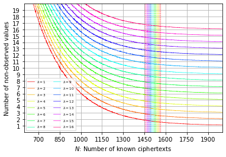
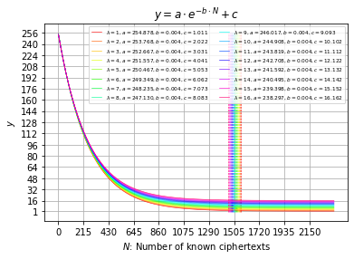
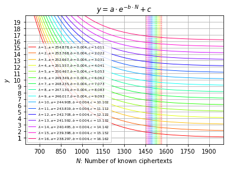
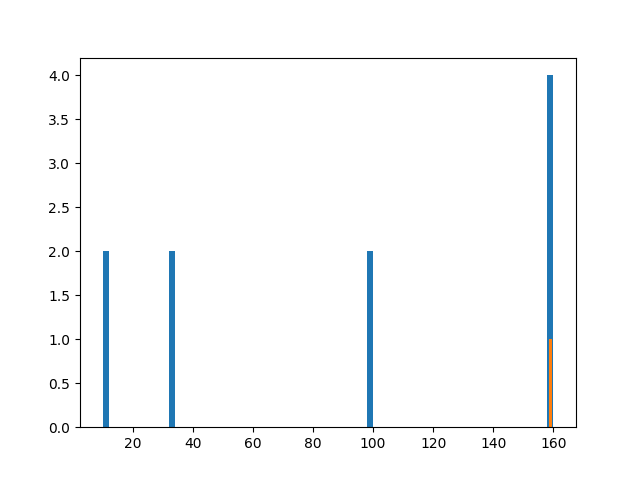

# Multiple Persistent Faults Attack - Faulty AES

This repository complements our research documented in [Practical Multiple Persistent Faults Analysis](https://www.iacr.org/cryptodb/data/paper.php?pubkey=31580) which has been accepted to [IACR-CHES-2022](https://ches.iacr.org/2022/).

ePrint version: [Practical Multiple Persistent Faults Analysis](https://eprint.iacr.org/2021/1362)




- [Multiple Persistent Faults Attack - Faulty AES](#multiple-persistent-faults-attack---faulty-aes)
  - [Prerequisites](#prerequisites)
  - [Implement (Faulty) AES-128](#implement-faulty-aes-128)
  - [Using NIST Test Vectors to Verify the Correctness of AES Implementation](#using-nist-test-vectors-to-verify-the-correctness-of-aes-implementation)
  - [Experiment 1](#experiment-1)
  - [Generate Diagrams of Our Paper](#generate-diagrams-of-our-paper)
  - [Experiment 2 - Implement Algorithm 1 to Find deltaj = skR[0] + skR[j]](#experiment-2---implement-algorithm-1-to-find-deltaj--skr0--skrj)
  - [Experiment 3 - Implement Algorithm 2 to Find deltaj = skR[0] + skR[j]](#experiment-3---implement-algorithm-2-to-find-deltaj--skr0--skrj)
  - [Algorithm 3 to Find D0*](#algorithm-3-to-find-d0)
  - [Algorithm 4 - Key Recovery 1](#algorithm-4---key-recovery-1)
  - [Parallel Key Recovery 1](#parallel-key-recovery-1)
  - [Algorithm 4 - Key Recovery 1 For Faulty S-boxes Derived in the Laboratory](#algorithm-4---key-recovery-1-for-faulty-s-boxes-derived-in-the-laboratory)
  - [Algorithm 5 - Key Recovery 2](#algorithm-5---key-recovery-2)
  - [Algorithm 5 - Key recovery 2 For Faulty S-boxes Derived in the Laboratory](#algorithm-5---key-recovery-2-for-faulty-s-boxes-derived-in-the-laboratory)
  - [License](#license)

## Prerequisites

We have implemented our experiments in Python language. Besides some standard Python libraries such as `math`, `statistics`, and `pickle`, which are commonly included in Python distributions, we have used some additional Python libraries such as `numpy`, `scipy`, and `matplotlib` in our work. To make the use of our codes easy, we have provided a [requirements.txt](requirements.txt) file including the additional libraries and a user can simply get them all by running the following single line command:

```
python3 -m pip install -r requirements.txt
```

We also used [Jupyter Notebook](https://jupyter.org/) to implement some of our experiments.

## Implement (Faulty) AES-128

In [faultyaes.py](faultyaes.py) we have included an implementation AES in Python language which can be used to simulate the multiple persistent fault injection. Moreover, it is supposed that key schedule is not affected by the faults.

## Using NIST Test Vectors to Verify the Correctness of AES Implementation

To check the correctness of our AES implementation, you are welcome to run `pytest test.py`.

```sh
pytest test.py
```

Terminal output:

```txt
============================= test session starts ==============================
platform linux -- Python 3.8.10, pytest-6.2.5, py-1.11.0, pluggy-1.0.0
rootdir: /home/hhadipour/Desktop/faultyaes
collected 2 items                                                              

test.py ..                                                               [100%]

============================== 2 passed in 0.00s ===============================
```

Reference: Test vectors have been taken from [NIST](https://csrc.nist.gov/CSRC/media/Projects/Cryptographic-Standards-and-Guidelines/documents/examples/AES_Core128.pdf)


## Experiment 1

Assuming that `number_of_faults` faults have been applied, we generate `N` random (faulty) ciphertexts and collect the observed values at each output byte of ciphertext. We repeat this experiment for several random master keys to see how many random queries is required on average to observe all possible values at least once for an arbitrary output byte of ciphertext. 

Our codes to implement the experiment 1 is included in [experiment1.py](experiment1.py) and you can perform this experiment by the following command:

```sh
python3 experiment1.py 3
```

`3` in front of the above command, specifies the number of faults. So, you are welcome to enter any number between 1 and 64 as the number of faults in front of `python3 experiment1.py`.

The outputs of this command are the average number of non-observed values at each output byte as well as a figure visualizing these numbers:

```sh
Number of non-observed values on average:
5.60, 5.60, 5.60, 5.20, 
5.50, 5.40, 5.50, 5.70, 
5.90, 5.80, 6.00, 5.40, 
5.40, 5.10, 5.60, 5.80, 
Number of faults: 5
Expected number of queries based on our paper: 1533
```


    
## Generate Diagrams of Our Paper

The codes required to produce the figures of our paper, are included in [](), and you can reproduce the shapes by running the following command:

```sh
python3 gendiagrams.py
```

After running the above command, figures are generated and stored in side the folder [Figures](Figures) in [svg](https://en.wikipedia.org/wiki/Scalable_Vector_Graphics) format.

**Plot the Number of Non-observed Values With Respect to the Number of Available Ciphertexts - Overview**


    
**Plot the Number of Non-observed Values With Respect to The Number of Available Ciphertexts - Close up**



**Fit an Exponential Curve to Derived Data - Overview**
    

    
**Fit an Exponential Curve to Derived Data - Close up**


    
## Experiment 2 - Implement Algorithm 1 to Find deltaj = skR[0] + skR[j]
In this experiment we aim to check how Algorithm 1 in our paper works in practice. Our codes implementing the algorithm 1 as well as experiment 2, are included in [experiment2.py](experiment2.py). To run experiment 2 issue the following command:

```sh
python3 experiment2.py
```

The output of this command is the candidates for the deltaj as well as a bar plot representing the frequency of other candidates:

```txt
Number of available ciphertexts: 3080
Candidates for delta5: [159]
skR[0] xor skR[5]: 159
```


    
## Experiment 3 - Implement Algorithm 2 to Find deltaj = skR[0] + skR[j]

In this experiment we aim to implement the algorithm 2 to see how it works in practice. Moreover, in this experiment it is supposed that a limited number of ciphertexts are available. Our codes implementing algorithm 2 as well as the experiment 3 are included in [experiment3.py](experiment3.py), and you can perform experiment 3 by running the following command:

```sh
python3 experiment3.py
```

If you run the above command, you will get something like this as the output:

```txt
Experiment No:   1
Experiment No:   2
...
...
...
Experiment No:  99
Experiment No: 100
Number of known ciphertexts: 1173
Average number of candidates for deltaj in each output byte: 2.14
Number of key candidates: 2^(24.42)
```

## Algorithm 3 to Find D0*

Our codes concerning Algorithm 3 are located in the following path:

  - Markdown: [KeyRecovery2.md](KeyRecovery2.md)
  - Jupyter: [KeyRecovery2.ipynb](KeyRecovery2.ipynb)
  
## Algorithm 4 - Key Recovery 1

Our codes concerning Algorithm 4 are located in the following path:

  - Markdown: [KeyRecovery1.md](KeyRecovery1.md)
  - Jupyter: [KeyRecovery1.ipynb](KeyRecovery1.ipynb)

## Parallel Key Recovery 1

Our codes to parallelize algorithm 4 are located in the following path:

  - Markdown: [ParallelKeyRecovery.md](ParallelKeyRecovery.md)
  - Jupyter: [ParallelKeyRecovery.ipynb](ParallelKeyRecovery.ipynb)
  - Python script: [ParallelKeyRecovery.py](ParallelKeyRecovery.py)

## Algorithm 4 - Key Recovery 1 For Faulty S-boxes Derived in the Laboratory

Our codes concerning Algorithm 4 for some faulty S-boxes derived in the laboratory:

  - Markdown: [KeyRecovery1ForGivenFaultySboxesFromTheLab.md](KeyRecovery1ForGivenFaultySboxesFromTheLab.md)
  - Jupyter: [KeyRecovery1ForGivenFaultySboxesFromTheLab.ipynb](KeyRecovery1ForGivenFaultySboxesFromTheLab.ipynb)


## Algorithm 5 - Key Recovery 2

Our codes implementing the Algorithm 5 can be found in the following path:

  - Markdown: [KeyRecovery2.md](KeyRecovery2.md)
  - Jupyter: [KeyRecovery2.ipynb](KeyRecovery2.ipynb)

## Algorithm 5 - Key recovery 2 For Faulty S-boxes Derived in the Laboratory

Our codes concerning Algorithm 5 for some faulty S-boxes derived in the laboratory:

  - Markdown: [KeyRecovery2ForGivenSboxesFromTheLab.md](KeyRecovery2ForGivenSboxesFromTheLab.md)
  - Jupyter: [KeyRecovery2ForGivenSboxesFromTheLab.ipynb](KeyRecovery2ForGivenSboxesFromTheLab.ipynb)

## License

```sh
Copyright (C) 2021  Hosein Hadipour
This program is free software: you can redistribute it and/or modify
it under the terms of the GNU General Public License as published by
the Free Software Foundation, either version 3 of the License, or
(at your option) any later version.
This program is distributed in the hope that it will be useful,
but WITHOUT ANY WARRANTY; without even the implied warranty of
MERCHANTABILITY or FITNESS FOR A PARTICULAR PURPOSE.  See the
GNU General Public License for more details.
You should have received a copy of the GNU General Public License
along with this program.  If not, see <http://www.gnu.org/licenses/>.
```